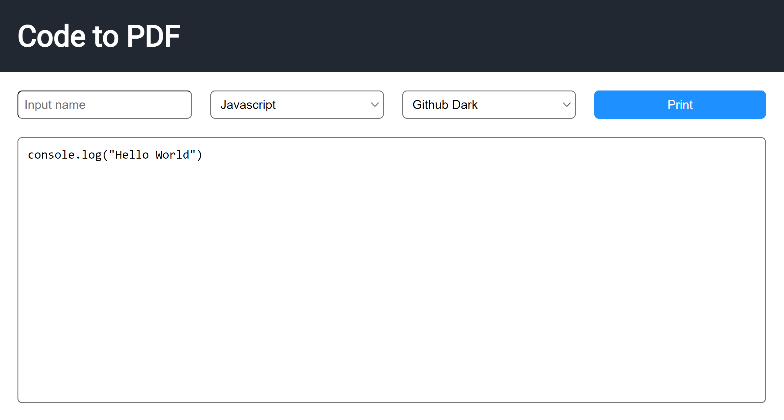

# Code to PDF Generator

Code to PDF is a website that allows users to paste source code and generate a PDF file with highlighted syntax. It is built using JavaScript and the highlight.js library.

## TODO
- [ ] Add lines for white theme to better see outline
- [ ] Improve button colors and sizing
- [ ] Add icon for website

## Features
- Text box to paste source code
- Syntax highlighting using the [highlight.js](https://highlightjs.org/) library
- Ability to select different themes and programming languages

